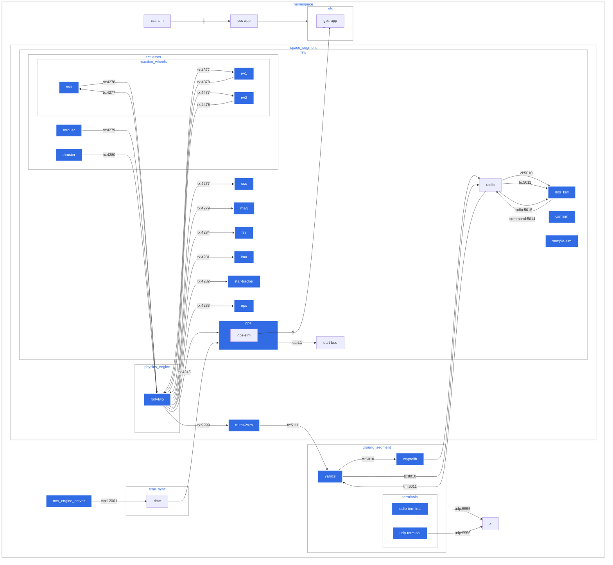

#



## docker ps

```bash
docker ps | grep -v 'CONTAINER ID' |wc -l
24

```

```bash
docker ps

CONTAINER ID   IMAGE                     COMMAND                  CREATED              STATUS          PORTS                                                                                                NAMES
3a130fadaea9   ivvitc/nos3-64:20250217   "./nos3-single-simul…"   41 seconds ago       Up 40 seconds                                                                                                        nos_time_driver
9661c0fa0ac8   ivvitc/nos3-64:20250217   "./nos3-single-simul…"   49 seconds ago       Up 47 seconds                                                                                                        sc_1_torquer_sim
4ff3a142614a   ivvitc/nos3-64:20250217   "./nos3-single-simul…"   50 seconds ago       Up 47 seconds                                                                                                        sc_1_thruster_sim
277b46405250   ivvitc/nos3-64:20250217   "./nos3-single-simul…"   50 seconds ago       Up 48 seconds                                                                                                        sc_1_startrk_sim
44d1809986f5   ivvitc/nos3-64:20250217   "./nos3-single-simul…"   50 seconds ago       Up 48 seconds                                                                                                        sc_1_sample_sim
dcde3f725275   ivvitc/nos3-64:20250217   "./nos3-single-simul…"   51 seconds ago       Up 47 seconds   0.0.0.0:16010->6010/tcp, 0.0.0.0:16010->6010/udp, 0.0.0.0:16011->6011/tcp, 0.0.0.0:16011->6011/udp   sc_1_radio_sim
1e0a92b988c3   ivvitc/nos3-64:20250217   "./nos3-single-simul…"   51 seconds ago       Up 48 seconds                                                                                                        sc_1_rw_sim2
eb3bc34fcc2f   ivvitc/nos3-64:20250217   "./nos3-single-simul…"   51 seconds ago       Up 49 seconds                                                                                                        sc_1_rw_sim1
0c327e64ef4e   ivvitc/nos3-64:20250217   "./nos3-single-simul…"   52 seconds ago       Up 50 seconds                                                                                                        sc_1_rw_sim0
9c6166335f7f   ivvitc/nos3-64:20250217   "./nos3-single-simul…"   52 seconds ago       Up 50 seconds                                                                                                        sc_1_mag_sim
523b92a28e7f   ivvitc/nos3-64:20250217   "./nos3-single-simul…"   53 seconds ago       Up 50 seconds                                                                                                        sc_1_imu_sim
82dfa03e9c62   ivvitc/nos3-64:20250217   "./nos3-single-simul…"   53 seconds ago       Up 51 seconds                                                                                                        sc_1_gps_sim
af58b5d09af2   ivvitc/nos3-64:20250217   "./nos3-single-simul…"   53 seconds ago       Up 51 seconds                                                                                                        sc_1_fss_sim
42fe85609195   ivvitc/nos3-64:20250217   "./nos3-single-simul…"   54 seconds ago       Up 51 seconds                                                                                                        sc_1_eps_sim
ac7787f9cf7a   ivvitc/nos3-64:20250217   "./nos3-single-simul…"   54 seconds ago       Up 51 seconds                                                                                                        sc_1_css_sim
5aedf4c0a619   ivvitc/nos3-64:20250217   "./nos3-single-simul…"   56 seconds ago       Up 53 seconds                                                                                                        sc_1_truth42sim
0282c8fb48e2   ivvitc/nos3-64:20250217   "/usr/bin/nos_engine…"   57 seconds ago       Up 53 seconds                                                                                                        sc_1_nos_engine_server
14e98992d60b   ivvitc/nos3-64:20250217   "./support/standalone"   57 seconds ago       Up 54 seconds                                                                                                        sc_1_cryptolib
0c06e9b85d03   ivvitc/nos3-64:20250217   "/opt/neo/nos3/scrip…"   57 seconds ago       Up 53 seconds                                                                                                        sc_1_nos_fsw
1e84eafbabe1   ivvitc/nos3-64:20250217   "/opt/neo/nos3/scrip…"   58 seconds ago       Up 54 seconds                                                                                                        sc_1_onair
2365e959b0c6   ivvitc/nos3-64:20250217   "/home/neo/.nos3/42/…"   58 seconds ago       Up 55 seconds                                                                                                        sc_1_fortytwo
72c26bc3690a   ivvitc/nos3-64:20250217   "./nos3-single-simul…"   59 seconds ago       Up 58 seconds                                                                                                        nos_udp_terminal
96c8948f8b01   ivvitc/nos3-64:20250217   "./nos3-single-simul…"   59 seconds ago       Up 58 seconds                                                                                                        nos_terminal
f78f9bda0e0a   ivvitc/nos3-64:20250217   "mvn -Dmaven.repo.lo…"   About a minute ago   Up 58 seconds   0.0.0.0:5012->5012/tcp, 0.0.0.0:8090->8090/tcp                                                       cosmos_openc3-operator_1

```

## docker network list

```bash

docker network list

NETWORK ID     NAME                DRIVER    SCOPE
2a772b648d00   bridge              bridge    local
5fe825f9aaa9   docker_quickstart   bridge    local
6652439bc0af   host                host      local
8cd5a6aac2de   none                null      local
6c6e8d8284e4   nos3_core           bridge    local
cca8286b3dd6   nos3_sc_1           bridge    local

```
