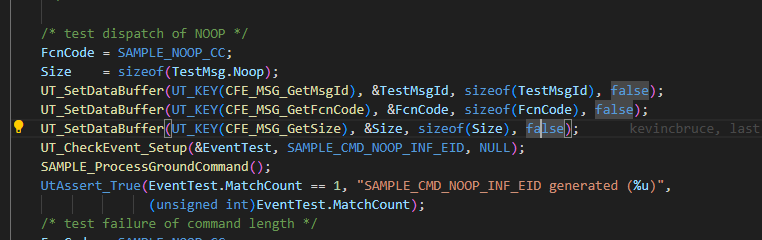
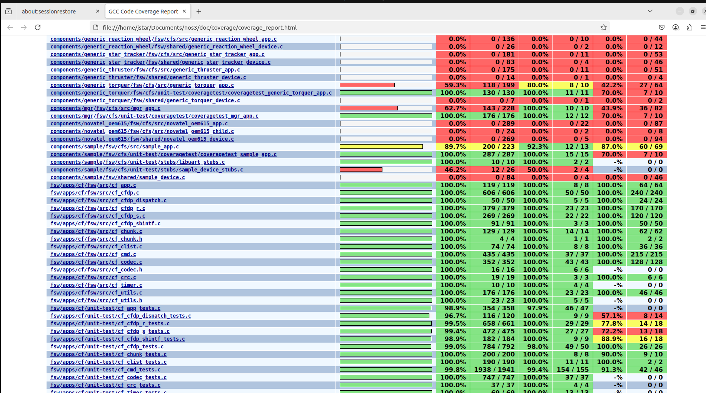

# Scenario - Unit Test Creation

This scenario was developed to give trainees a walkthough of how to create a unit testing framework for a component within NOS3.

# Learning Goals 

By the end of this scenario you should be able to 
* Create unit tests to check the functionality of NOS3 satellite components and their commands
* Create unit tests for a brand new component or add to an existing test suite
* Reach full coverage for all relevant files within a component

# Prerequisites 
Before running the scenario, ensure the following steps are completed:
* [Getting Started](./Getting_Started.md)
  * [Installation](./Getting_Started.md#installation)
  * [Running](./Getting_Started.md#running)

# File Structure Exploration
With a terminal navigated to the top level of your NOS3 repository:
* `cd /nos3/components/sample/fsw/cfs/unit-test`
* If there is no unit-test directory within the cfs directory of your component, either copy one from sample or generate one with the sample script
* Ensure that the unit-test folder you are working from is within the fsw/cfs/ directory

Once you are in the unit-test folder
* Run the command `ls`
* You should see `CMakeLists.txt  coveragetest/  inc/  stubs/` as the output, if any files are missing, again copy from the sample component or generate with the sample script
* Open the `CMakeLists.txt` file
* Check that the name of the component files being included match the component you are working with, if not change them to match. Then close the file
* Navigate to the `coveragetest/`
* Run the command `ls` again, you should see `coveragetest_sample_app.c  sample_app_coveragetest_common.h` as the two files within this directory
* The `coveragetest_sample_app.c` is the file you will be writing the unit tests in
* `cd ..` out of `coveragetest`
* Run `cd inc` and open the `ut_sample_app.h` ensure here that the name of the files being included matches the component you intend to work on
* Finally `cd ..`, `cd stubs`, and `ls`
* You should see `libuart_stubs.c  sample_device_stubs.c`
* Check both files to make sure the component name matches the one you are working
* `cd ..` and `cd coveragetest/`
* open `coveragetest_sample_app.c`

# Writing Unit Tests
* Inside the coveragetest_sample_app.c file
* This file is where you will write your actual unit tests
* Within the coveragetest file you will see an array of existing functions such as `Test_SAMPLE_AppMain`, `Test_SAMPLE_AppInit`, `Test_SAMPLE_ProcessCommandPacket`,`Test_SAMPLE_ReportHousekeeping`, etc
* These functions are split up this way to interact directly with similarly named functions in the `sample/fsw/cfs/src/sample_device.c` file

# Example of NOOP Test
* As a specifica example whithin the `Test_SAMPLE_ProcessGroundCommand` function, where a marjority of our commands are tested 

there is this chunk of code.

* The FcnCode is the command code is a key part of understanding the mechanics of NOS3, it is how the flight system is able to know which command is being sent and in this case specifies which is being tested. 
* The Size = sizeof(TestMsg.Noop) is how the length of the command is set, the key thing here is that commands without accompanying arguments all share one size, however other commmands that have arguments, in this case config, need to have a different size specified in the union struct at the top of the function
* The
  UT_SetDataBuffer(UT_KEY(CFE_MSG_GetMsgId), &TestMsgId, sizeof(TestMsgId), false);
  UT_SetDataBuffer(UT_KEY(CFE_MSG_GetFcnCode), &FcnCode, sizeof(FcnCode), false);
  UT_SetDataBuffer(UT_KEY(CFE_MSG_GetSize), &Size, sizeof(Size), false);
  lines specify the command string to be sent to cfs and is how the command is sent to the `sample_device.c file`
* `SAMPLE_ProcessGroundCommand();` Runs the command
* `UtAssert_True(EventTest.MatchCount == 1, "SAMPLE_CMD_NOOP_INF_EID generated (%u)",` checks the results
                  `(unsigned int)EventTest.MatchCount);`

# Building/Running the tests and generating a coverage report
* % make clean
* % make config
* % make prep
* % make
* % make debug
* % export CFLAGS="-fprofile-arcs -ftest-coverage -g" (.github/workflows/build.yml)
* % make build-test
* % make test-fsw
* % mkdir -p doc/coverage
* % gcovr --gcov-ignore-parse-errors --xml-pretty -o doc/coverage/coverage_report.xml
* % gcovr --gcov-ignore-parse-errors --html --html-details -o doc/coverage/coverage_report.html
* % exit
* % firefox doc/coverage/coverage_report.html

The coverage_report.html file will display the code coverage and tests result for every file in the directory

The resulting file should look like this when opened

