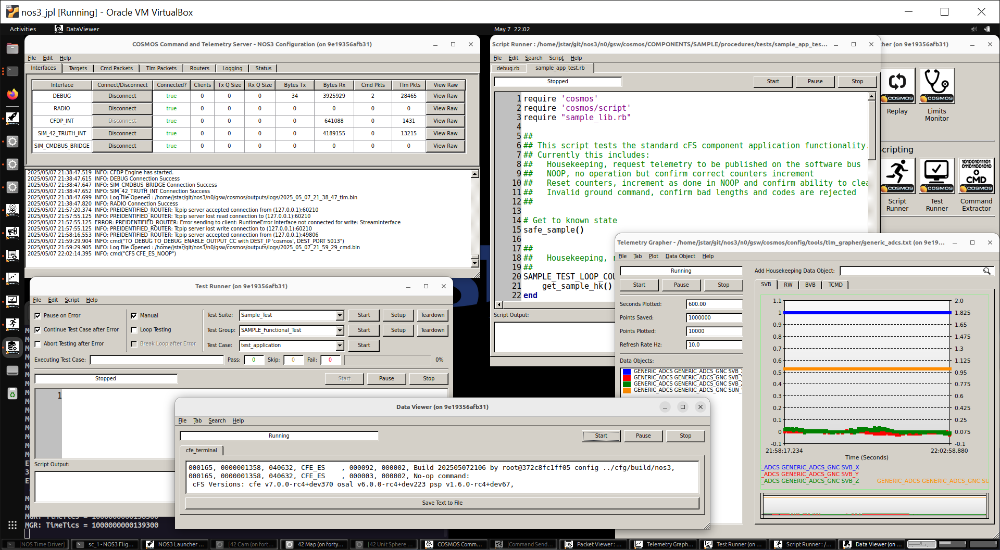

# Scenario - COSMOS

This scenario was developed to provide an overview of the Ball Aerospace COSMOS ground software (GSW) as implemented in the NASA Operational Simulator for Small Satellites (NOS3).
COSMOS is a comprehensive ground software suite developed by Ball Aerospace that provides command and control capabilities for embedded systems, particularly spacecraft.
In the NOS3 environment, COSMOS serves as the primary ground software interface.

This scenario was last updated on 5/7/25 and leveraged the `dev` branch at the time [46cfa02].

## Learning Goals

By the end of this scenario, you should be able to:
* Demonstrate end-to-end command and telemetry processing using COSMOS ground software tools
* Navigate and utilize key COSMOS applications (Command Sender, Packet Viewer, Test Runner) within the NOS3 environment
* Create and execute basic automated test procedures to validate spacecraft functionality
* Configure COSMOS interfaces for communicating with cFS applications and hardware components
* Monitor real-time telemetry and analyze spacecraft state

## Prerequisites

Before running the scenario, ensure the following steps are completed:
* [Getting Started](./Getting_Started.md)
  * [Installation](./Getting_Started.md#installation)
  * [Running](./Getting_Started.md#running)
* [Scenario - Demonstration](./Scenario_Demo.md)

## Walkthrough

COSMOS is a suite of applications that can be used to control a set of embedded systems. These systems can be anything from test equipment (power supplies, oscilloscopes, switched power strips, UPS devices, etc), to development boards (Arduinos, Raspberry Pi, Beaglebone, etc), to satellites.

COSMOS implements a client server architecture with the Command and Telemetry Server and the various other tools typically acting as clients to retreive data. The Command and Telemetry Server connects to the Targets (green circles) and sends commands and receives telemetry (status data) from them. Targets are the items you’re trying to control or get status from. The arrows from the Server to the targets indicate Interfaces which can be over TCP/IP, serial, UDP/IP, or a custom interface that you define. Yellow boxes indicate data items like configuration files, log files, reports, etc.

While the initial NOS3 demonstration utilized COSMOS, a lot of the specifics were glossed over.
With a terminal navigated to the top level of your NOS3 repository:
* `make clean`
  * Note that we clean here just in case previous files exist from other scenarios now that we have changed the configuration.
* `make`
* `make launch`

First, let's take a look at the COSMOS Launcher.
The launcher itself is configurable to remove tools you don't use, or make special buttons specific to your mission.
The [./gsw/cosmos/config/tools/launcher/launcher.txt](https://github.com/nasa-itc/gsw-cosmos/blob/nos3-dev/config/tools/launcher/launcher.txt) contains the specific version used in NOS3 by default.
Looking at that launcher configuration file you can see the top left "COSMOS" button actually does multiple things.

Let's review review the components that open when you click the top left "COSMOS" button:
* Command and Telemetry Server
  * The central communication hub that handles interfaces (primarily UDP in NOS3) and protocols for data exchange with the flight system.
* Command Sender
  * Allows operators to search, select, and send commands to targets, with both standard (debug) and RADIO interface options in NOS3.
* Packet Viewer
  * Real-time telemetry visualization tool that displays raw and derived telemetry values with automated updates and unit conversions.

Each of these tools has a number of useful things to an operator:
* Command and Telemetry Server
  * It's important to always have this visible as it will be the fastest means to see if your communications link drops.
  * Additionally if you have red / green limits set, they are displayed in the event log.
  * All commands from the ground are captured here as well do you know if maybe a script you have running to automate a pass had an issue.
  * The other tabs are useful to view specific commands and telemetry, both in human readable and raw hex if you prefer.
* Command Sender
  * Immediately take note that the top search bar exist, you can type in your command instead of searching manually.
  * Targets for each component are separated out and in NOS3 we have decided to append _RADIO to indicate that target's interface to use.
  * Note that you may need to resize the window in order to more easily modify the commands (typically try wider first).
* Packet Viewer
  * Note that items with an * prepended are metadata that COSMOS appends to the actual received data.
  * Due to time not being wall clock, it can be confusing and is recommended you use the spacecraft time for analysis instead of the meta data.
  * Move your mouse over an item or value and note that the comments for that item show up on the bottom of the packet viewer.
  * Right clicking an item or value will allow you to:
    * View details with hex values, data types, units, etc.
    * Graph that specific value over time (note by default it uses the meta data time).

Some additional tools a spacecraft operator should know about include:
* Data Viewer
  * Text based data visualization of log files, memory dumps, and event messages.
* Telemetry Grapher
  * Provides graphical representation of telemetry values over time with configurable axes and display options.
* Test Runner
  * Executes automated test procedures organized in suites, groups, and cases, generating detailed reports of command execution and telemetry verification.
* Script Runner
  * Uses Ruby to create automated operations procedures, debugging tools, and continuous tasks such as thermal control during testing.

While there are other tools, this should get you through the initial scenario set.

---
### Additional References

Some documentation related to Ball Aerospace's COSMOS may be found at the following link:
* https://ballaerospace.github.io/cosmos-website/docs/v4/
