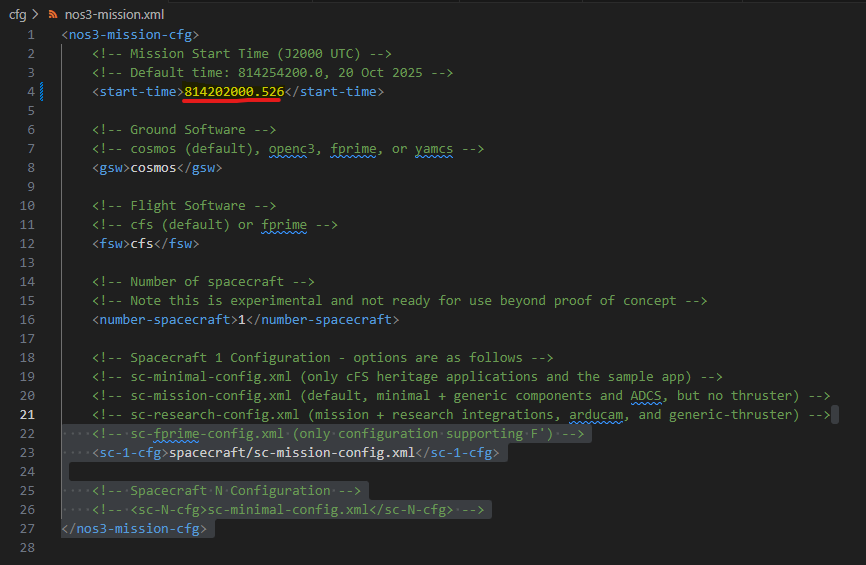
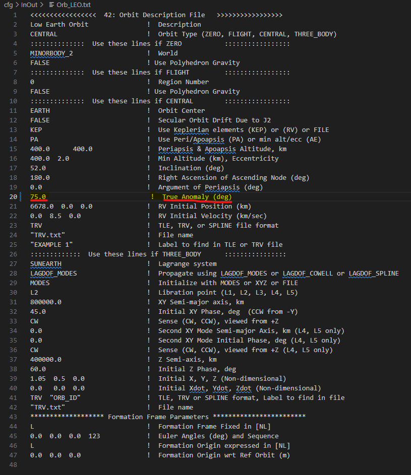
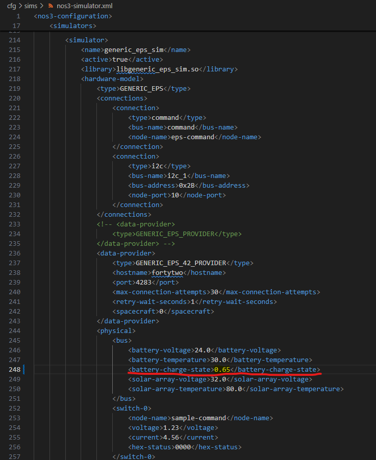
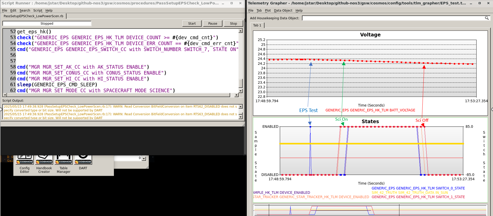
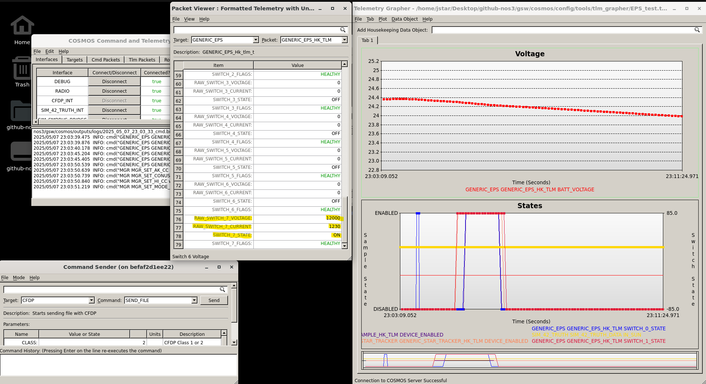
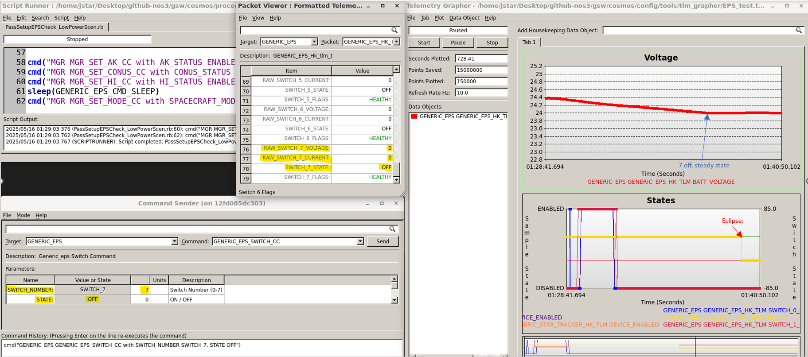
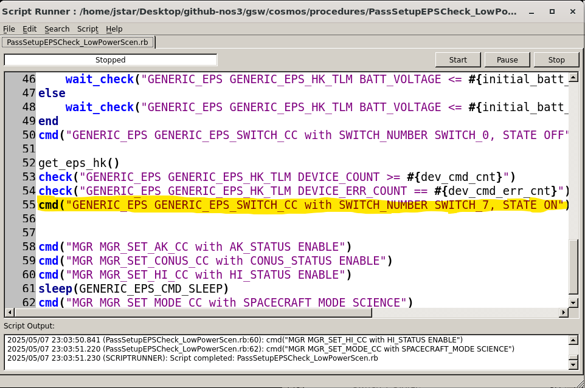

# Scenario - Low Power

This scenario was developed to demonstrate how to identify and resolve an emergency situation that develops in flight, specifically one related to low power.

## Learning Goals
By the end of this scenario you should be able to:
- Analyze a complex situation with limited information to determine the cause of an anomaly
- Learn about low power contingencies in space operations
- Learn how to patch a mission in flight to correct such an anomaly

## Prerequisites
Before running the scenario, ensure the following steps are completed:

- [Getting Started](./Getting_Started.md)
    - [Installation](./Getting_Started.md#installation)
    - [Running](./Getting_Started.md#running)

You should also likely review the following lessons before this one:
- [STF - Quick Look](./STF_QuickLook.md)
- [Scenario - ADCS Walkthrough](./Scenario_ADCS_Walkthrough.md)
- [Scenario - In Flight Patching](./Scenario_Patching.md)
- [Scenario - Adding FDC Check for Sample Disabled to Science Mode](./Scenario_Fault_Science.md)
- [Scenario - Commanding ADCS in Science Mode](./Scenario_Controlling_ADCS_During_Science.md)

## Introduction
The goal of this scenario is to build off of much of the knowledge gained in previous scenarios to identify and solve a low power issue that develops on-orbit during mission operations. The following is the situation presented:

You are a member of the Software Maintenance Team for the STF mission. It has launched, been commissioned, and has been running over the US. Its power state has slowly declined over time, though still within normal limits, and is still recharging during daytime when science data is not being gathered or a pass is not being taken. The Mission Operations Center (MOC) reports that they have conducted a routine partial check of the EPS, which was sent from the ground based off the System Tests for EPS.  While conducting this and reactivating Science Mode in preparation for the next pass,  Active Science was inhibited due to a low power state.  The satellite is also not charging as normal, but is actively discharging. With it entering eclipse shortly, there is concern that the spacecraft will drop to a dangerously low power state before it can charge again, assuming whatever is preventing charging is resolved. You are called by the MOC to triage the situation and provide an in-flight patch to try and save the mission.

## Step 1 - Scenario Setup
In order to set up this scenario, a few configuration changes need to be made to NOS3. First, you will need to set the starting time of the mission to `814202000.526` in your `cfg/nos3_mission.xml`. 
This should set you into a situation with an evening/night science pass over the US.

Additionally, you will need to go into the `cfg/InOut/Orb_LEO.txt` file and change the `True Anomaly` parameter from `0.0` to `75.0`. This should start your spacecraft in a position near Alaska.

Finally, you will want to change your `<battery-charge-state>` parameter under the EPS section of your `cfg/sim/nos3-simulator.xml` from `1.0`, which denotes a 100% state of charge, to around `0.65`, which would denote a 65% charge. This will simulate the spacecraft already being in a low power state.

Now, rebuild and launch NOS3 as you would normally. I would also encourage minimizing the 42 GUI and FSW consoles and using COSMOS for all your information, as this would put you in a perspective most similar to 
that of an Operator in the MOC.
- _Note: In the future, you could launch NOS3 in operator mode with `make cosmos-operator` and follow the instructions in the terminal to make sure everything launches. This would put you in a more operator-like 
mode to start, though the 42 GUI will still launch. However, this feature is still in development, so simply using `make launch` as usual is advised._

Wait 30 seconds, then open the Script Runner and Telemetry Grapher. In Telemetry Grapher, launch the `EPS_test.txt` and then hit Start. This will track your power level and switch/in sun statuses in the graph. Then, go to Script Runner, hit open, and go to `cosmos/procedures`. Select `PassSetupEPSCheck_LowPowerScen.rb` in the new window, and once it is open, hit Start. This is the setup and test file the MOC ran that seems to have caused the issue. It was intended to test the EPS, and then set up Science Mode. Let the simulator run, and observe that the power starts dropping after the science pass starts as you would expect, but then the science pass stops prematurely, and the power is still draining despite that. This is the point where you would enter to begin triage with the night approaching.

## Step 2 - Identification and Triage
This section will cover how to utilize a combination of tools in COSMOS and a logical thinking process to precisely identify points of failure that may be causing the issue.

### Part A: Pinpointing Possible Issues
Since the issue appears to be an unexpected power drain, even during daytime, the first place that should make sense to look would be the EPS Telemetry. Go to your Packet Viewer window, and navigate to `GENERIC_EPS` in the `Target` dropdown. There should be only one Packet for it, so simply scroll through and observe. Switches 0 and 1 should be off, but you may notice that switch 7, which should be unused, is on and 
drawing quite a bit of power.

The temporary fix at this stage would be to go to your Command Sender and command switch 7 off manually, and verify that it turns off in your Telemetry Viewer. This should decrease the power draw to safer levels.

### Part B: Finding the Cause
Now that the issue has been identified and temporarily fixed, the next move should be to determine what may have caused the problem. The first two places that should come to mind as likely culprits are a faulty RTS table (which is incorrectly activating the switch), or an errant ground command. In this case, if we check the script that was run to set up the pass, you may notice an errant switch command, which turns on switch 7. This seems to be the point of failure here, so you should be sure it is removed or fixed for future passes.

If it was *not* in the ground script, then the next place to check would be whether the backup versions of the RTS tables that have been checked for the error are sent up to overwrite any currently onboard, as discussed in the In-Flight Patching Scenario. Although in this case the problem has been solved, given the error identified, and the speed of discharged observed, the Operations Team deems it wise to add in some sort of failsafe to ensure that possible future operator error cannot lead to the complete death of the spacecraft.

## Step 3 - Planning the Failsafe
As emphasized in previous scenarios, before any changes to mission behavior are made, one should consider what exactly needs to be done, how to do it, where the changes need to be made, and any new edge cases that may arise from this new behavior.

### Part A: Determining Scope
In this case, we want to add a new contingency where, if the battery gets below a critical level it will go into a known safe state. We may also want to make sure any existing power-related triggers go to a fully determined EPS state, though that is up to your discretion. The Avionics Team reports that the spacecraft battery should be recoverable as long as it does not drop below 25%. Thus, 40% is deemed a safe cutoff margin to go into a known safe state in the case of extreme power loss while still being able to survive a night and recharge. 

This means we will need a new LC Watchpoint for 40% power, designed similarly to the existing 60% watchpoint, and we will need to ensure it is activated when entering Science Mode. Then, we need to create a new RTS that will transition to Safe Mode if the watchpoint is triggered. Finally, if it is determined that we want to add additional safety measures to our existing low power Science Pause at 60%, we would need to modify that RTS as well.

### Part B: Determining Modifications for Behavior
Now that we've determined the scope, we need to consider what is necessary for these changes. The LC tables and RTS tables will need to be modified or added as shown in the FDC Check Scenario to add a new watchpoint at 40% power, and to ensure it is activated. Then, any safe mode transitions need to add new commands to turn off all switches (including any that are not being currently used). Existing RTSs only turn switches 0 and 1 off, so new commands for switches 2 through 7 need to be added. The new Safe Mode Entry tables should also have switches 0 through 7 and any associated apps (in this case Sample and Star Tracker) turned off or disabled, respectively.

### Part C: Considering Edge Cases
Finally, now that we've determined what is necessary to achieve the desired behavior during Science Mode, we need to consider the new issues and edge cases that may arise when we leave active Science Mode or transition to Safe Mode. Due to the nature of this change, most edge cases should be covered, but it must be confirmed that these changes are added to all safe mode transitions, and all power-related transitions if deemed necessary. Additionally, as the original issue could have been caused by a copy-paste error, there should be abundant caution to avoid such mistakes in the new tables. That is another point where testing in simulation software, such as NOS3, becomes extremely valuable in actual operations - to assure that all the edge cases are tested and that patches do not have unintended negative consequences or points of failure.

## Step 4: Implementation
Implementation is left open for you to determine based on previous lessons, but the basic steps would be to add the watchpoint, add any new RTS tables, and modify the existing ones to use this watchpoint to reflect the planned behavior. Then, it will be necessary to either reboot the system and compile the new tables that way, or compile the tables in a testing environment such as NOS3, copy the compiled .tbl files during execution, and utilize CFDP and cFS's existing table commands to hot swap in the new tables (as shown in the In Flight Patching Scenario).

## Step 5: Verifying Intended Behavior
With this all completed, you should be able to confirm that it works by bringing up NOS3, launching COSMOS, and running the low power scenario as described in Step 1, but with your patches. Then, observe the telemetry and see if it enters your mode at 40%. Also, if you added the commands to toggle all switches off at 60% power, then confirm that charging resumes for any remaining daylight after the spacecraft enters science passive. You can also test your patches through the Sim Bridge commands by manually setting your state of charge to 40% and making sure the failsafe triggers.

## Conclusions
Through this Scenario, you have gained a degree of confidence in putting all the previous lessons together to address a real scenario and see it successfully resolved, as well as gaining a better understanding of how to find the cause of an emergency utilizing only the data available to a spacecraft operator on the ground.
