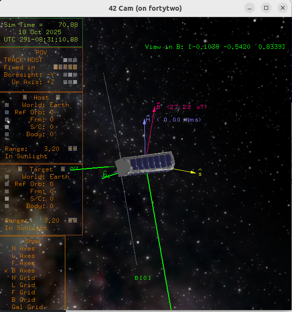
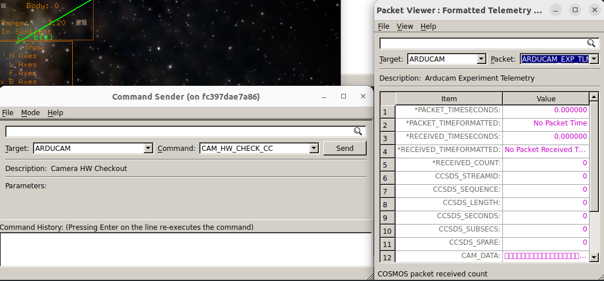

# Scenario - Nominal Operations

This scenario was developed to explain and demonstrate the standard (nominal) operation of a satellite in orbit, using NASA Operational Simulator for Small Satellites (NOS3).
It demonstrates the use of the ground software (GSW) and the expected return telemetry, as well as making use of flight software (FSW) and simulators.

This scenario was last updated on INSERT_DATE_HERE and leveraged the `dev` branch at the time [TIME_HERE].

## Learning Goals

By the end of this scenario, you should be able to:
 * Connect to the simulated spacecraft at the beginning of a simulated pass
 * Send commands to change state or downlink data
 * Understand what portions of NOS3 would be accessible or visible in the context of a real satellite
 * Recognize anomalous telemetry
 * Take a simulated pass with NOS3

## Prerequisites

Before running the scenario, ensure the following steps are completed:
* [Getting Started](./Getting_Started.md)
  * [Installation](./Getting_Started.md#installation)
  * [Running](./Getting_Started.md#running)

## Walkthrough

With a terminal navigated to the top level of your NOS3 repository, run make clean and make:
 * `make clean`

 * `make`

Then, launch NOS3 and open COSMOS:

Open the script runner.  
In the script runner, perform File->Open... and choose the `gsw/cosmos/config/targets/MISSION/procedures/nominal_ops.rb` script.  
Press `Start`:

This script will approximate several aspects of taking a pass. 

**_NOTE:_** The user must select `go` in the script runner window when they are done commanding for the pass, since the script does not stop and disconnect COSMOS automatically.
Also, typical passes are of short duration (8-10 minutes) and it is up to the operator to keep track of time and when the pass ends.

### Connect to the Spacecraft

Before you can do anything else with the spacecraft, you must connect to it.  In NOS3 this is handled automatically, but with a real satellite this would have to be done first, in conjunction with the ground station and at the appropriate time for when your particular satellite would be in range.

### Confirm Telemetry is Nominal

#### COSMOS Alone

The first task to confirm that spacecraft telemetry is nominal by checking that data is being downlinked and that commands are being sent.  Both can be confirmed by use of the NOOP command.
On an actual spacecraft, the only information to which you would have access would be COSMOS and its associated outputs.  As such, we will start by looking only at those to confirm that the spacecraft is in a nominal state before looking at other pieces of information.
Among the COSMOS windows, make sure the Command Sender and Telemetry Viewer are both visible, and in both, navigate to the GENERIC_IMU:

Within the Telemetry Viewer, it is possible to see both housekeeping information and regular data, which will allow confirming that information is being sent down and that the satellite is not spinning or in a bad situation physically (the values of the IMU's rotational sensors should all be near zero).  
Now, to confirm that ground commands have an impact on the IMU, start by sending a NOOP command.  This should increment the command counter under the housekeeping data, like so:

Note that the command counter has increased by one.

The other component which should be checked to ensure nominal operations is the electrical power system, or EPS.  Check that the EPS is sending telemetry and is able to receive commands in the same way.

#### 42 and the Simulator

On an actual mission, this (COSMOS) would be all the information you have available.  When running in a simulator, however, there is more information to which you have access, and which can tell you in fairly short order about the state of the spacecraft and whether it's in nominal operations. 

The two other places where information about the spacecraft state is available are 42 and the various simulators.  The simulators are all launched as tabs on the terminal from which you launched NOS3, and a simulator in a nominal state will be both running and (likely) have some message indicating its successful launch and connection to the buses.  Below is an image of the Generic IMU simulator tab, after it has successfully completed construction but before it has begun sending telemetry (which happens automatically):

Then, 42 will indicate the state of the spacecraft to some degree.  Its camera window will show whether the spacecraft is rotating significantly, as well as showing the spacecraft attitude with respect to the Sun and its location over the Earth:  

### Send Commands

Once the spacecraft is known to be in a nominal state, the next step is to either send commands or to downlink data.  This scenario will provide an example of each.

For an example of sending a command, we will direct the spacecraft to enter science mode.  
The example spacecraft in NOS3 conducts science using the sample instrument when over the US; it has to be activated into science mode, however, to start doing this.  We will do so via COSMOS.  

First, navigate to the Command Sender and go to the MGR under "Target".  Do the same with the Packet Viewer, like so:

Notice the various commands listed in the dropdown menu.  For this we will be sending one to activate science mode (this tells the spacecraft that it's OK to perform science when conditions allow).  This is done by going to "MGR_SET_MODE_CC" and, in the dropdown menu therein, selecting "SCIENCE_ACTIVE" as the mode:

Once sent, the "SPACECRAFT_MODE" in the Packet Viewer should switch to SCIENCE_ACTIVE.  This change can also be seen in the Flight Software (FSW) terminal.

### Downlink Data

Next we will go through an example of downlinking data.  This is the other thing likely to be done during a pass. 

Our example will be to downlink a picture from the Arducam, using the CAM_EXP_3 commands.  Typically this is how downlinking data will have to be done; some kind of command will trigger it.  

The first task, like above, is to navigate to the ARDUCAM target of the Command Sender and the Packet Viewer:

Notice that both the data and the housekeeping data (HK) of the Arducam are pink, indicating no recent change.  In this case, that is because the Arducam is not connected to start; we will have to connect it with CAM_HW_CHECK_CC.  This will connect both the SPI and I2C buses of the Arducam and leave us ready to downlink a picture.  This is done with the CAM_EXP3_CC command

