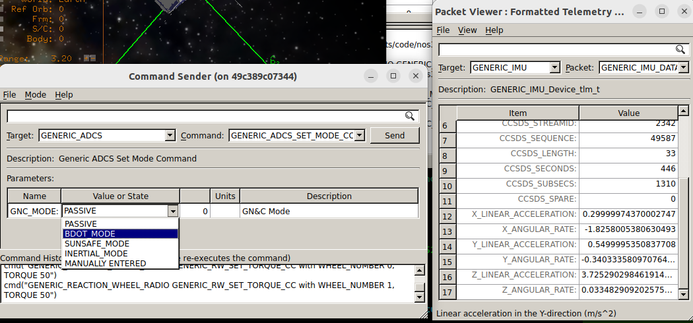

# Scenario - Rapid Tumbling

For a variety of reasons, a spacecraft can begin rotating out-of-control on orbit.  Perhaps it was released with some nonzero initial angular momentum, or an error with a reaction wheel or such caused it to start spinning far faster than it ever should have.  Whatever the cause, knowing how to slow down and return to nominal operations is important, and NOS3 can be used to simulate this.

At present, however, NOS3 runs slowly enough that working through a rapid tumbling scenario takes too long.  As such, this document will merely describe the steps one would follow, without providing anything with which to follow along.

## Learning Goals

By the end of this scenario, you should be able to:
* Identify a spacecraft as rapidly tumbling, using only COSMOS
* Take steps to correct this behavior 

## Prerequisites

Before running the scenario, ensure the following steps are completed:
* [Getting Started](./Getting_Started.md)
  * [Installation](./Getting_Started.md#installation)
  * [Running](./Getting_Started.md#running)
* No additional file changes or special setup is needed for this scenario

## Outline

First, we would run a script (or launch NOS3) with some conditions to create/cause a rapid tumbling problem.  This could be done in NOS3 by one of two ways:
 * To launch NOS3 with the spacecraft rapidly tumbling, we would adjust some parameters in the spacecraft config file to give the spacecraft a tip-off angular velocity.
 * To launch NOS3 and spin up the spacecraft excessively, we would launch normally and then use the simulator backdoor commands (`SIM_CMD_BUS`) to command one or more of the reaction wheels to spin uncontrolled.

### Determining the Problem

Before attempting any remediations, it is necessary to determine the cause of the problem.  In the case of rapid tumbling, the spacecraft could have begun spinning due to a malfunction in one of the reaction wheels, or from some external cause.  This can be determined by checking (in COSMOS) the state of the IMU, as below:

In general, anything above 10deg/sec is considered rapid tumbling.  If the problem is due to something in the spacecraft itself, that root problem must first be remedied before trying to solve the rapid tumbling.  As NOS3 presently exists, however, there is no way for the reaction wheels to be "stuck on", or the like, and therefore we can go to the next section.

### Solving the Problem

If the problem is due to the environment (but the spacecraft itself is fine), all that must be done is to put the spacecraft into safe mode and tell it to go into either BDot mode (the purpose of which is to reduce rotational speed to zero) or to point at the Sun (which will likewise require the rotational speed to go to zero).  The image below shows the menu in COSMOS, with BDOT highlighted; basically any spacecraft mode other than "PASSIVE" will work, however.

With BDOT mode initialized, the magnetorquers will begin to slow down the rotation of the spacecraft.  The process will likely take multiple orbits to stop completely, even with the very powerful simulated magnetorquers on STF.  

This concludes the description of a rapid tumbling scenario.  

