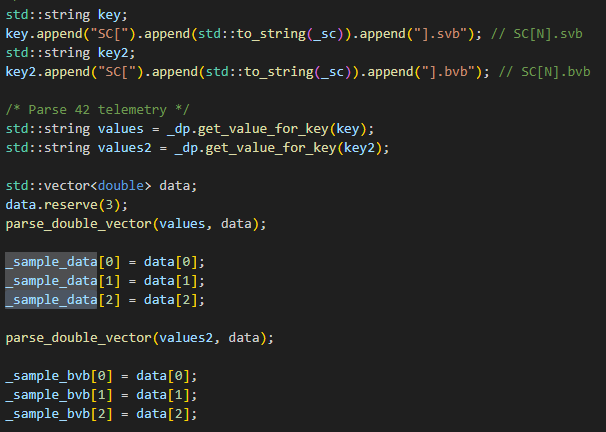
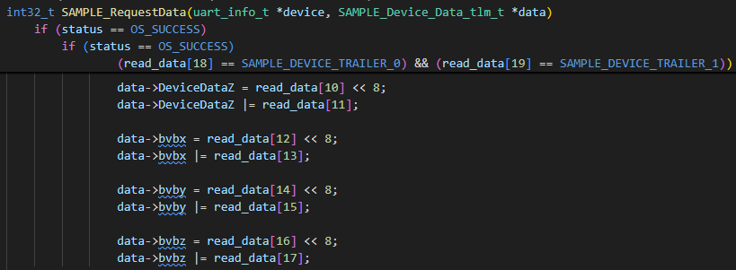

# Scenario - Simulator Expansion

This scenario was developed to capture how to expand a simulator.
In this scenario, we will expand the Sample simulator to use additional data from 42.
This scenario will show how data flows through the entire system, from 42 to a simulator to a component application to COSMOS telemetry for an application.

## Learning Goals

By the end of this scenario, you should be able to:
* Turn on 42 output in the 42 window
* Enhance the Sample simulator to retrieve additional data from 42
* Enhance the Sample simulator to provide additional data to flight software
* Enhance the Sample flight software to receive additional data from the simulator and to provide additional telemetry for the additional data
* Enhance the Sample telemetry definition to view additional telemetry for the additional data
* Run NOS3 and view the additional data in the Sample telemetry

## Prerequisites

Before running the scenario, ensure the following steps are completed:
* [Getting Started](./Getting_Started.md)
  * [Installation](./Getting_Started.md#installation)
  * [Running](./Getting_Started.md#running)
* No additional file changes or special setup is needed for this scenario

## Walkthrough

### Turn on 42 output in the 42 window
Edit `cfg/sims/nos3-simulator.xml`.
Locate the "sample_sim" simulator section.  
Comment out the "SAMPLE_PROVIDER" section and uncomment the "SAMPLE_42_PROVIDER" section.

Edit `cfg/InOut/Inp_IPC.txt`.
Add an 11 line section to the end that is like the previous section.  Change the filename to "SAMPLE.42" and the host port to "4242" and echo to stdout to "TRUE".

Change line 2 to be one more than the current value.
Run `make launch`.
The 42 window should now show 42 output.

Run `make stop`.

### Enhance the Sample simulator to retrieve additional data from 42
Edit the `components/sample/sim/src/sample_data_point.cpp` file.
Add another key to extract the "SC[0].bvb" data.
Add line to get value for key.
Add parsing and saving of the "bvb" data.

Add "_sample_bvb" array to the "SampleDataPoint" and add getter methods (`sample_data_point.hpp`).

### Enhance the Sample simulator to provide additional data to flight software
Edit the `components/sample/sim/src/sample_hardware_model.cpp` file.
Add "bvb" data to the out_data in the "create_sample_data()" method.

Run `make launch`.
The 42 window should now show 42 output and the sample sim window should show a connection to get the 42 data.
Run `make stop`.

### Enhance the Sample flight software to receive additional data from the simulator and to provide additional telemetry for the additional data
Edit the `components/sample/fsw/shared/sample_device.c` file.
Add "bvb" data reads in the "SAMPLE_RequestData()" function.

Edit the `components/sample/fsw/shared/sample_device.h` file.
Add "bvb" members to the "SAMPLE_Device_Data_tlm_t" structure.

### Enhance the Sample telemetry definition to view additional telemetry for the additional data
Edit the `components/sample/gsw/SAMPLE/cmd_tlm/SAMPLE_TLM.txt` telemetry definition file.
Add "bvb" telemetry points to the "SAMPLE_DATA_TLM" telemetry packet.

### Run NOS3 and view the additional data in the Sample telemetry
Run `make launch`.

